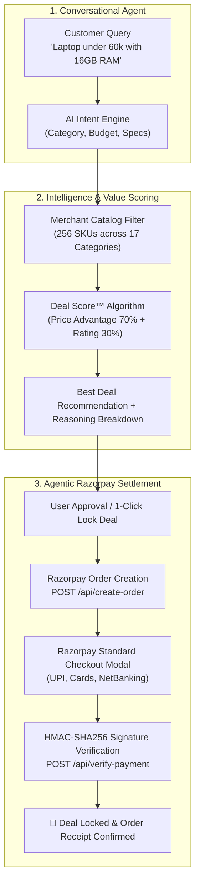

# 🚀 DealLock AI — Autonomous Best Deal Shopping Agent

> **Track 01 — AI Growth & Agentic Commerce | Razorpay Hackathon**  
> DealLock AI is an AI-powered shopping agent that understands natural-language buying requirements, scans merchant catalogs, computes multi-factor **Deal Scores**, recommends the best-value deal, and settles orders seamlessly through **Razorpay**.

---

## 💡 The Problem

Traditional online shopping is plagued by comparison fatigue:
1. Shoppers open 15+ browser tabs.
2. Manually apply 10+ rigid filters.
3. Compare prices, RAM, specs, and ratings across dozens of models.
4. Over **70% of carts are abandoned** due to decision fatigue.

## 🎯 The Solution: DealLock AI

DealLock AI turns product discovery and purchasing into an intelligent, conversational workflow:
* **Natural-Language Intent Extraction:** Shoppers simply say:  
  *`"I need a laptop under 60k with 16GB RAM for coding"`*
* **Merchant Catalog Matching:** Evaluates **256 SKUs across 17 categories**.
* **Explainable Deal Score™ Algorithm:** Combines price advantage relative to budget (70% weight) and customer ratings (30% weight) to recommend the genuine highest-value deal.
* **Agentic Razorpay Checkout:** Automatically generates a Razorpay Order, launches checkout, cryptographically verifies HMAC-SHA256 signatures, and confirms the deal.
* **Merchant Growth Hub:** Gives merchants real-time analytics on AI buyer transactions, inventory metrics (₹76.4L stock), and automated pricing suggestions to win AI recommendations.

---

## 🏗️ Architecture



---

## 🌟 Key Features

1. **Natural Language Buying Intent:**
   * Understands shorthand budgets (`60k`, `₹40,000`, `10k`), technical constraints (`16GB RAM`), and synonyms (`MacBook`, `iPad`, `PS5`, `TWS`, `smartwatch`).
2. **Deep Merchant Inventory:**
   * 256 realistic products across 17 tech categories: Laptops, Smartphones, Tablets, Earbuds, Headphones, Smartwatches, Gaming Consoles, Monitors, Keyboards, Mice, Speakers, Smart TVs, SSDs, Routers, Power Banks, Webcams, and Cameras.
3. **Transparent Deal Scoring:**
   * Not just raw ratings! Explains *why* a product won:
     * *✓ Within your ₹60,000 budget*
     * *✓ Meets your 16GB RAM requirement*
     * *✓ Highest overall Deal Score (95.2/100)*
4. **End-to-End Razorpay Integration:**
   * Real Razorpay Orders API integration with HMAC-SHA256 signature verification and deterministic sandbox fallback for offline demos.
5. **Merchant Growth Portal (Track 01):**
   * Live inventory analytics, agent-driven GMV tracker, and automated pricing guidance to help merchants convert autonomous AI buyers.

---

## 🚀 Quick Start

### 1. Prerequisites
* Python 3.10+
* Git

### 2. Clone the Repository
```bash
git clone <your-repo-url>
cd deallock-ai
```

### 3. Start the Backend
```bash
cd backend
pip install -r requirements.txt
python main.py
```
Backend runs at: `http://127.0.0.1:8000`

### 4. Open the Frontend
* Open `frontend/index.html` in your web browser (or click "Go Live" in VS Code).
* The root `index.html` automatically routes you to the application.

---

## 🔌 API Endpoints

| Method | Endpoint | Description |
| :--- | :--- | :--- |
| `GET` | `/` | Backend health & catalog overview |
| `GET` | `/health` | Server status |
| `GET` | `/products` | Full merchant product catalog with base scores |
| `GET` | `/categories` | List of 17 supported categories |
| `POST` | `/ai-search` | Natural language shopping query $
ightarrow$ Best Deal + Matches |
| `POST` | `/api/create-order` | Initiates Razorpay order for 1-click deal settlement |
| `POST` | `/api/verify-payment` | Cryptographic signature verification and order confirmation |
| `GET` | `/api/orders` | Store transaction log of locked deals |
| `GET` | `/api/merchant/analytics` | Track 01 Merchant Growth metrics & insights |

---

## 🏆 Hackathon Alignment (Track 01)

* **Direction A (AI Growth):** Eliminates cart abandonment, increases conversion through transparent deal evaluation, and provides merchants with AI demand insights.
* **Direction B (Agentic Commerce):** Bridges the gap between conversational AI and payment execution, positioning Razorpay as the universal settlement layer for future autonomous AI buyers.

---

**Built with ❤️ for the Razorpay Hackathon 2026**
